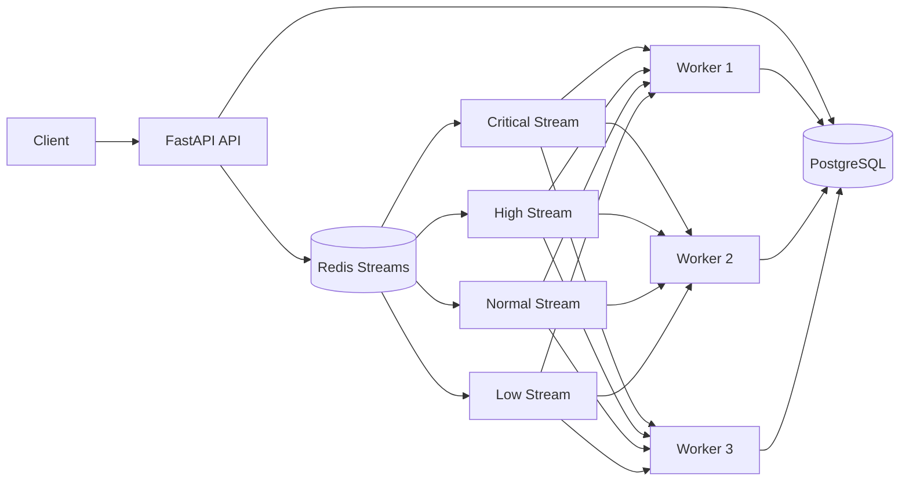

# FlowQueue

FlowQueue is a distributed background-job orchestration platform built with FastAPI, PostgreSQL, Redis Streams, and horizontally scalable workers.

It provides persistent job state, priority-aware scheduling, distributed worker coordination, retries, crash recovery, and containerized deployment through Docker Compose.

## Architecture



Jobs are submitted through the FastAPI service and persisted in PostgreSQL before being placed onto Redis Streams.

Workers consume jobs through Redis consumer groups using the following scheduling order:

```text
CRITICAL → HIGH → NORMAL → LOW
```

Multiple worker instances can consume from the same streams, allowing FlowQueue to scale horizontally while Redis coordinates job delivery.

## Features

* FastAPI REST API for job submission and status retrieval
* PostgreSQL-backed persistent job state
* Redis Streams based job queue
* Four priority levels: critical, high, normal, and low
* Distributed Redis consumer groups
* Horizontally scalable workers
* Retry tracking and failure handling
* Dead-letter handling for exhausted jobs
* Recovery of stale pending messages
* Configurable maximum retries
* Dockerized API, worker, PostgreSQL, and Redis
* Docker Compose orchestration
* Automated end-to-end integration tests
* Benchmark tooling for worker-scaling experiments

## Job Lifecycle

```text
Client
  ↓
POST /jobs
  ↓
FastAPI
  ↓
PostgreSQL
  ↓
Redis priority stream
  ↓
Worker claims job
  ↓
running
  ↓
Task execution
  ↓
succeeded / retry / failed
  ↓
PostgreSQL status update
```

A client can retrieve the current state of a job using:

```http
GET /jobs/{job_id}
```

Typical states include:

```text
queued
running
succeeded
failed
```

## Tech Stack

**Backend:** Python, FastAPI, SQLAlchemy, Pydantic

**Database:** PostgreSQL

**Queue:** Redis Streams

**Worker model:** Redis consumer groups with distributed workers

**Infrastructure:** Docker and Docker Compose

**Testing:** Pytest integration tests

## Running with Docker

Build and start the complete FlowQueue stack:

```bash
docker compose up --build
```

This launches:

```text
FastAPI
PostgreSQL
Redis
FlowQueue Worker
```

The API becomes available at:

```text
http://localhost:8000
```

Check system health:

```bash
curl http://127.0.0.1:8000/health
```

Expected response:

```json
{
  "status": "healthy"
}
```

## Submitting a Job

Example:

```bash
curl -X POST http://127.0.0.1:8000/jobs \
  -H "Content-Type: application/json" \
  -d '{
    "task_name": "send_email",
    "payload": {
      "recipient": "example@example.com",
      "sleep_seconds": 2
    },
    "priority": "high",
    "max_retries": 3
  }'
```

The API returns a job containing its UUID and initial state.

Example:

```json
{
  "id": "b99f474a-3ce4-400d-b0d0-142499176f67",
  "task_name": "send_email",
  "priority": "high",
  "status": "queued",
  "retry_count": 0,
  "max_retries": 3
}
```

## Horizontal Scaling

FlowQueue workers are stateless consumers and can therefore be replicated horizontally.

For example, launch three workers using:

```bash
docker compose up -d --scale worker=3
```

Redis consumer groups distribute queued jobs among the available workers.

## Benchmark Results

A local Docker benchmark was performed using 10 background jobs with identical simulated task workloads.

| Configuration | Total Time | End-to-End Throughput |
| ------------- | ---------: | --------------------: |
| 1 worker      |    8.169 s |           1.22 jobs/s |
| 3 workers     |    3.331 s |           3.00 jobs/s |

Increasing the worker pool from one worker to three produced approximately:

```text
2.46× throughput
145.9% throughput increase
59.2% lower completion time
~82% scaling efficiency
```

The benchmark demonstrates that worker execution can scale horizontally while the API, Redis Streams, and PostgreSQL remain shared infrastructure.

Run the benchmark with:

```bash
python scripts/benchmark.py --jobs 10 --sleep 0.2
```

## Testing

Install development dependencies:

```bash
pip install -r requirements-dev.txt
```

Run the integration suite:

```bash
pytest -q
```

The integration test verifies the real system flow:

```text
API
 ↓
PostgreSQL
 ↓
Redis Streams
 ↓
Worker
 ↓
Task execution
 ↓
Job status persistence
```

## Reliability Design

FlowQueue uses Redis Streams rather than a simple in-memory queue so queued work can participate in durable stream processing and distributed consumer coordination.

Consumer groups enable multiple workers to share the workload without requiring a centralized scheduler.

Workers track message acknowledgement and job state separately, allowing interrupted work to be detected and recovered.

Pending messages that remain idle can be reclaimed by active workers, providing crash-recovery behavior when a worker disappears during processing.

Failed jobs can be retried according to their configured retry limit, while jobs that exhaust retry handling can be moved out of the normal processing path for inspection.

## Project Structure

```text
flowqueue-proj/
│
├── backend/
│   └── app/
│       ├── api/
│       ├── config.py
│       ├── database.py
│       ├── main.py
│       └── models.py
│
├── worker/
│   ├── main.py
│   ├── database.py
│   ├── redis_client.py
│   └── tasks.py
│
├── tests/
│   └── test_integration.py
│
├── scripts/
│   └── benchmark.py
│
├── Dockerfile
├── docker-compose.yml
├── requirements.txt
├── requirements-dev.txt
└── README.md
```

## Engineering Goals

FlowQueue was built as a system-design and backend-engineering project exploring:

* distributed job processing
* queue scheduling
* horizontal worker scaling
* durable state management
* distributed consumer coordination
* failure recovery
* retry strategies
* containerized service orchestration
* performance benchmarking

## Future Work

Possible extensions include worker heartbeats, Prometheus metrics, Grafana dashboards, scheduled jobs, rate limiting, task timeouts, queue observability, authentication, Kubernetes deployment, and autoscaling based on queue depth.

## Live Deployment

FlowQueue is deployed on Render with separate API, PostgreSQL, Redis/Valkey, and worker services.

### Public API

https://flowqueue-api.onrender.com

Health check:

```bash
curl https://flowqueue-api.onrender.com/health